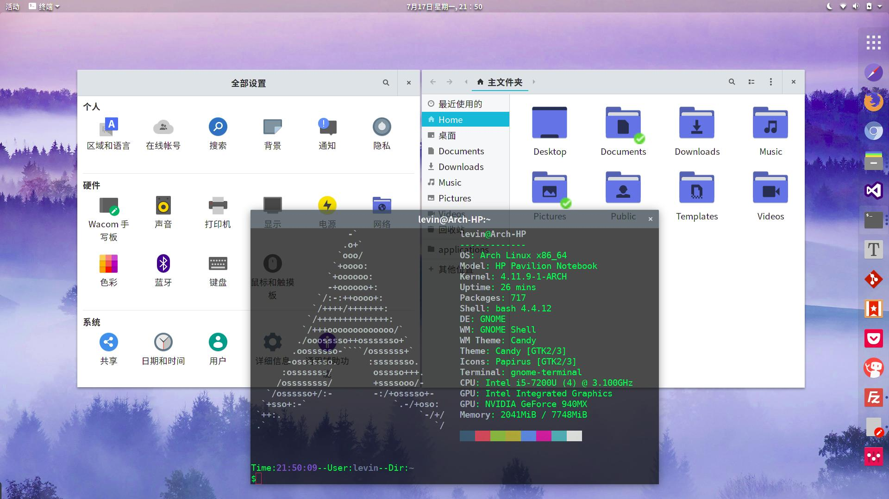

Candy GTK+ & Shell Theme
---

Original Author:Umayanga Sandeepa

Some little modifes.

# Introduction
Gnome 3.20 COMPATIBLE.Added Unity Support.

What's this Candy theme?

- GTK+ theme is based on Flat-Plat theme.
- Shell theme is based on Adapta theme.
- Android Jelly Bean styled "Show Applications" icon in dash.

# Installation

Extract it and copy "Candy" folder to the theme directory.

- For system-wide: copy **Candy** to `/usr/share/themes/`
- For user-specific: copy **Candy** to `~/.themes` ( if this folder was not exist,create it:`mkdir ~/.themes `)
- For ArchLinux(and others based on archlinux) user: AUR [candy-gtk-theme](https://aur.archlinux.org/packages/candy-gtk-theme/)

# Enable Candy theme

- Use **gnome-tweak-tool** to change the theme.

or

- command-line: `gsettings set org.gnome.desktop.interface gtk-theme 'Candy'`.

or other ways...

# Thanks
candy's author: Umayanga Sandeepa.

>Special thanks to
>
>nana-4, the developer of Flat-Plat.
>https://github.com/nana-4/Flat-Plat
>
>tista500, the developer of Adapta.
>https://github.com/tista500/Adapta
